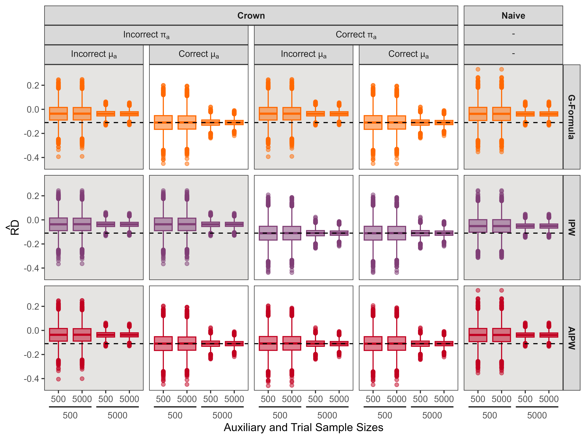
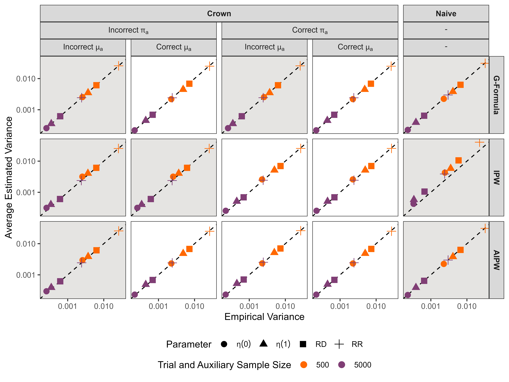
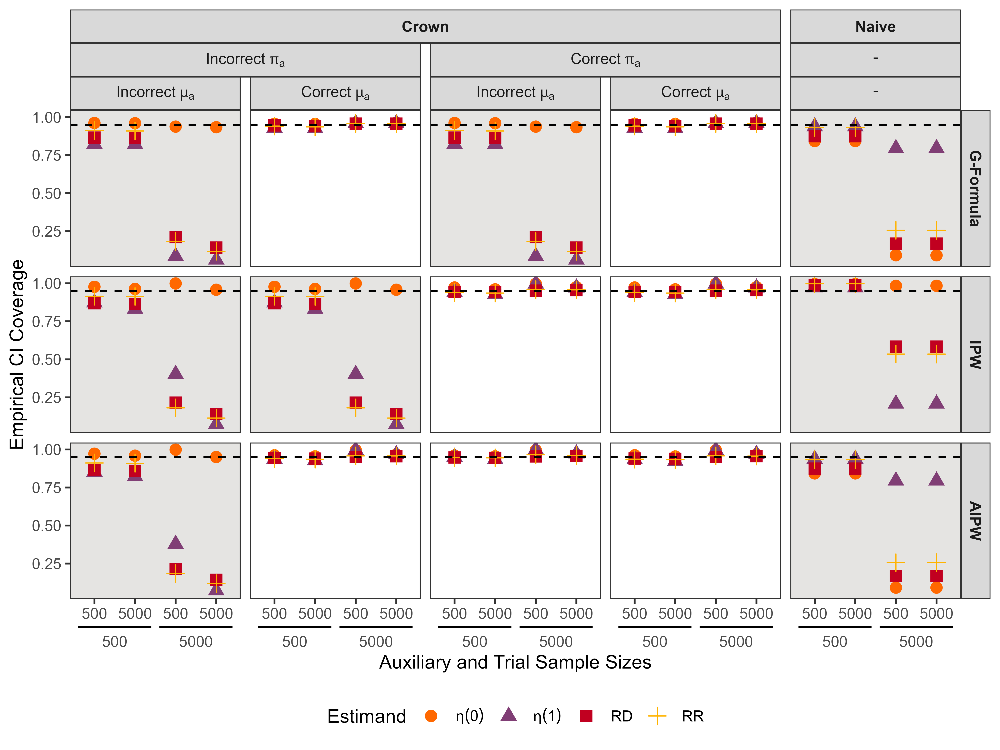
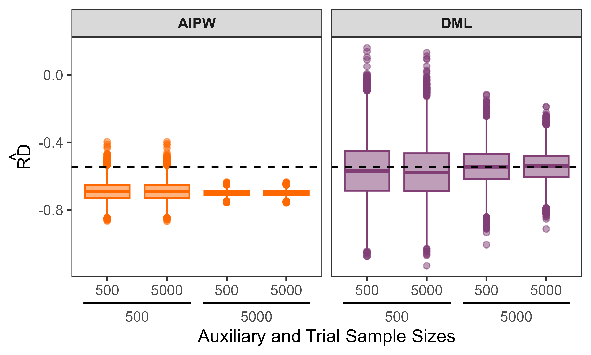
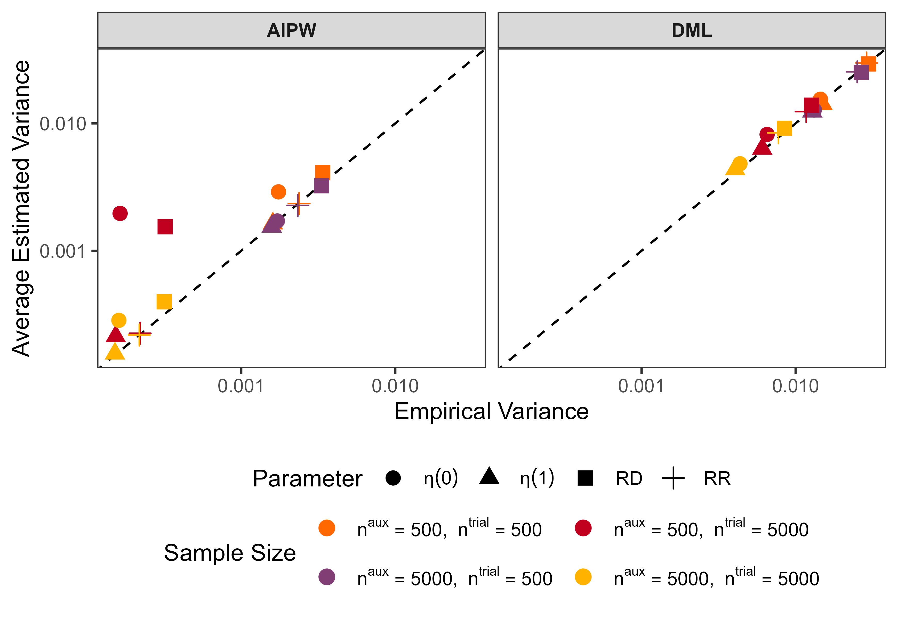
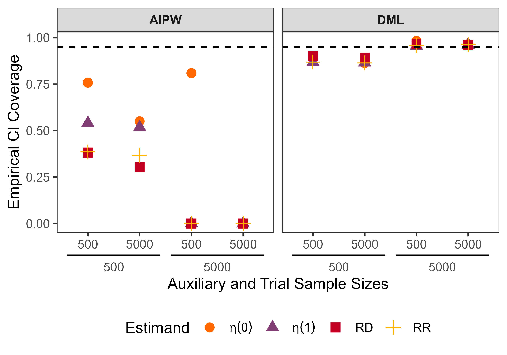

# crown: Cluster-Randomized Trial Analysis with Outcomes Weighted for Nonresponse

`crown` combines a cluster-randomized trial with auxiliary baseline data to
estimate population mean potential outcomes and population-average causal
effects on the risk-difference and risk-ratio scales.

## Installation

Install the current version from GitHub:

```r
install.packages("remotes")
library(remotes)
install_github("brian-d-richardson/crown", ref = "crown-1.0.0")
library(crown)
```

The required packages are installed automatically. `crown` requires R >= 4.1.

## Quick start

The package includes a weighted example with 50,000 trial observations and
50,000 auxiliary observations:

```r
library(crown)
data(crown_example)

trial <- crown_example[crown_example$S == 1, ]
auxiliary <- crown_example[crown_example$S == 0, ]
```

Run the default analysis, Proposed AIPW with cross-fitted XGBoost:

```r
fit <- crown(
  trial_data = trial,
  auxiliary_data = auxiliary,
  outcome = "Y",
  treatment = "A",
  response = "R",
  censoring = "C",
  cluster = "cluster",
  covariates = c("X1", "X2", "W1", "W2"),
  version = "proposed",
  estimator = "aipw",
  model = "xgboost",
  auxiliary_weight = "sampling_weight"
)

print(fit)
summary(fit)
```

### Example result

| Parameter | Estimate | Standard error | 95% CI |
|---|---:|---:|---|
| `eta(0)` | 0.272 | 0.005 | [0.263, 0.281] |
| `eta(1)` | 0.404 | 0.006 | [0.392, 0.416] |
| `RD` | 0.132 | 0.007 | [0.118, 0.147] |
| `RR` | 1.486 | 0.033 | [1.422, 1.550] |

## Choose the analysis

The main choices are made directly in `crown()`:

| Argument | Default | Choices |
|---|---|---|
| `version` | `"proposed"` | `"proposed"`, `"naive"` |
| `estimator` | `"aipw"` | `"aipw"`, `"gformula"`, `"ipw"` |
| `model` | `"xgboost"` | `"xgboost"`, `"logistic"` |

`proposed` combines trial outcomes with auxiliary covariates to adjust for
nonresponse and censoring. `naive` uses trial responders alone.

All 12 combinations return point estimates. Standard errors and 95% confidence
intervals are currently available for:

| Model | Version | Estimator | Auxiliary weight | CI |
|---|---|---|---|---|
| Logistic | Proposed | G-formula, IPW, or AIPW | With or without | Yes |
| Logistic | Naive | G-formula, IPW, or AIPW | Not used | Yes |
| XGBoost | Proposed | AIPW | With or without | Yes |
| XGBoost | Proposed | G-formula or IPW | With or without | No |
| XGBoost | Naive | G-formula, IPW, or AIPW | Not used | No |

XGBoost uses cross-fitting. `K = 5L` sets the number of folds. Use `arguments`
to pass XGBoost settings and `random_seed` to reproduce the fold split.

## Prepare your data

Pass the trial and auxiliary samples as separate data frames. One row represents
one person.

| Variable | Trial | Auxiliary |
|---|---|---|
| Cluster ID | Required | Required; must match a trial cluster |
| Treatment | Required and constant within cluster | Not required |
| Response | Required | Not required |
| Censoring | Required | Not required |
| Outcome | Required for uncensored responders | Not required |
| Covariates | Required | The same covariates are required |
| Sampling weight | Not used | Optional |

Use the column names when calling `crown()`. Missing outcomes are allowed for
nonresponders and censored responders.

### Auxiliary sampling weights

If auxiliary observations have equal sampling weights, leave the weight
unspecified:

```r
auxiliary_weight = NULL
```

If it has a sampling-weight column, provide its name:

```r
auxiliary_weight = "sampling_weight"
```

The weights are normalized to have mean one. They are used only by Proposed
analyses; Naive analyses do not use the auxiliary sample.

### Included weighted data

`crown_example` has 100,000 rows and 20 clusters. Each cluster contains 2,500
trial and 2,500 auxiliary observations. The auxiliary sample contains 1,500
people with `W1 = 1` and 1,000 with `W1 = 0` in each cluster, so `W1 = 1` is
deliberately oversampled. `sampling_weight` corrects this unequal sampling. The
compressed dataset is about 288 KB.

## Main functions

| Function | What it does |
|---|---|
| `crown()` | Runs one selected analysis |
| `fit_gformula()` | Fits parametric G-formula |
| `fit_ipw()` | Fits parametric IPW |
| `fit_aipw()` | Fits parametric AIPW |
| `dml_fit()` | Fits the lower-level cross-fitted estimator |

Use `print(fit)` for the four main estimates and `summary(fit)` for estimates,
standard errors, and confidence intervals. Unavailable intervals are shown as
`NA`.

## Simulations

The simulation code stays in the GitHub repository and is not included in the
installed package. From the `crown` source folder, run:

```r
install.packages(c("dplyr", "tidyr", "ggplot2", "ggh4x", "legendry"))
source("simulation/sim_scripts/ss1.R")
source("simulation/sim_scripts/ss2.R")
```

- Simulation 1 compares Naive and Proposed parametric G-formula, IPW, and AIPW.
- Simulation 2 compares Proposed parametric AIPW with cross-fitted XGBoost AIPW.
- Both use `(500, 500)`, `(500, 5000)`, `(5000, 500)`, and `(5000, 5000)` for
  `(n_trial, n_auxiliary)`.
- Both currently run 20 Monte Carlo replicates per sample-size combination.
- Replicates and folds run sequentially; XGBoost may use its own threads.

The figures below come from earlier 10,000-replicate runs and still need to be
verified against the current code.

### Simulation 1







### Simulation 2







## References

To be added.
