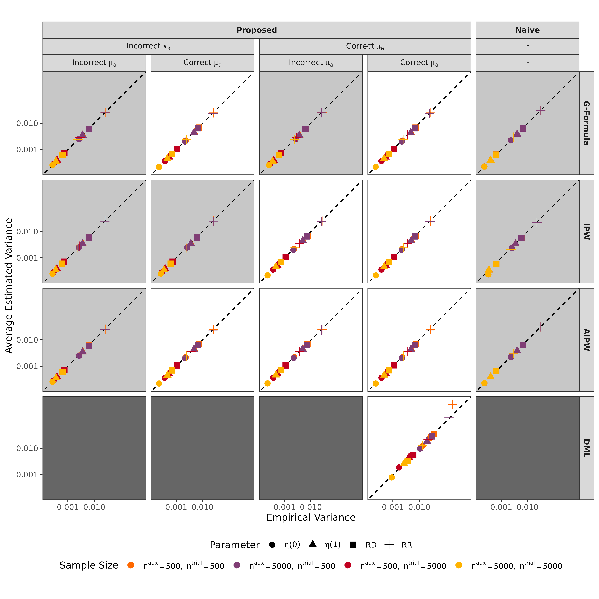
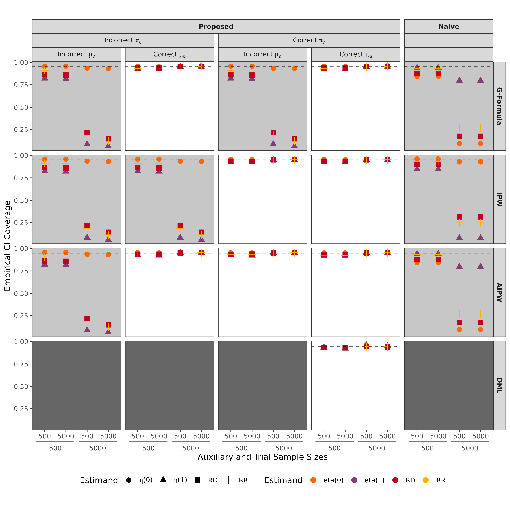
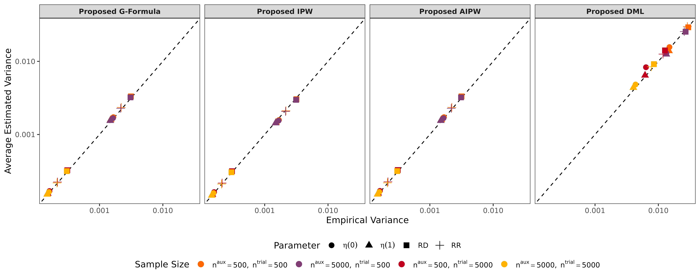
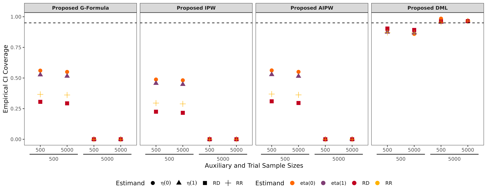

# crown

`crown` combines a cluster-randomized trial with an auxiliary sample to
estimate population mean potential outcomes, risk differences, and risk
ratios when trial outcomes are affected by nonresponse or censoring.

## Installation

Install from the package source directory:

```r
install.packages(".", repos = NULL, type = "source")
library(crown)
```

## Supported analyses

| Analysis | `version` | `estimator` | `model` |
|---|---|---|---|
| Naive G-formula | `"naive"` | `"gformula"` | `"logistic"` |
| Proposed G-formula | `"proposed"` | `"gformula"` | `"logistic"` |
| Naive IPW | `"naive"` | `"ipw"` | `"logistic"` |
| Proposed IPW | `"proposed"` | `"ipw"` | `"logistic"` |
| Naive AIPW | `"naive"` | `"aipw"` | `"logistic"` |
| Proposed AIPW | `"proposed"` | `"aipw"` | `"logistic"` |
| Proposed DML | `"proposed"` | `"aipw"` | `"xgboost"` |

These are the only supported combinations.

## Data requirements

| Variable | Trial | Auxiliary |
|---|---|---|
| Cluster ID | Required | Required; must match a trial cluster |
| Treatment | Required and constant within cluster | Not required |
| Response indicator | Required | Not required |
| Censoring indicator | Required | Not required |
| Outcome | Required for uncensored responders | Not required |
| Covariates | Required | Same covariates required |
| Sampling weight | Not used | Optional |

Provide the trial and auxiliary samples as separate data frames. If auxiliary
sampling weights are unequal, provide the weight-column name through
`auxiliary_weight`; otherwise leave it as `NULL`.

## Quick Start and Example

The package includes `crown_example`, a synthetic dataset with 50,000 trial
participants and 50,000 auxiliary participants across 20 clusters. Its first
five participants are:

| id | cluster | S | A | R | C | Y | X1 | X2 | W1 | W2 | sampling_weight |
|---:|---:|---:|---:|---:|---:|---:|---:|---:|---:|---:|---:|
| 1 | 11 | 1 | 1 | 1 | 0 | 1 | -2.1958 | 1 | 1 | 0.3342 | 1 |
| 2 | 11 | 1 | 1 | 1 | 0 | 0 | -2.1958 | 1 | 0 | 0.8751 | 1 |
| 3 | 11 | 1 | 1 | 1 | 0 | 0 | -2.1958 | 1 | 1 | -0.0489 | 1 |
| 4 | 11 | 1 | 1 | 0 | NA | NA | -2.1958 | 1 | 1 | -0.9554 | 1 |
| 5 | 11 | 1 | 1 | 1 | 0 | 0 | -2.1958 | 1 | 0 | -0.2128 | 1 |

Select an analysis through `version`, `estimator`, and `model`:

```r
data(crown_example)

trial <- crown_example[crown_example$S == 1, ]
auxiliary <- crown_example[crown_example$S == 0, ]

fit <- crown(
  trial_data = trial,
  auxiliary_data = auxiliary,
  outcome = "Y",
  treatment = "A",
  response = "R",
  censoring = "C",
  cluster = "cluster",
  covariates = c("X1", "X2", "W1", "W2"),
  version = "proposed",
  estimator = "aipw",
  model = "xgboost",
  auxiliary_weight = "sampling_weight"
)

summary(fit)
```

This call fits Proposed DML and returns:

```text
Crown causal estimates

 estimator  version   model eta(0) eta(1)    RD   RR
       DML Proposed XGBoost  0.272  0.404 0.132 1.49

5 folds of cross-fitting used.
  estimator  version   model       parameter estimate std_error         95% CI
1       DML Proposed XGBoost    mean_control    0.272     0.005 [0.263, 0.281]
2       DML Proposed XGBoost    mean_treated    0.404     0.006 [0.392, 0.416]
3       DML Proposed XGBoost risk_difference    0.132     0.007 [0.118, 0.147]
4       DML Proposed XGBoost      risk_ratio    1.486     0.033 [1.422, 1.550]
```

## Simulations

The simulation scripts run 50 Monte Carlo replicates per sample-size setting by
default. Change `mc_reps` near the top of each script for a different run:

```r
source("simulation/sim_scripts/ss1.R")
source("simulation/sim_scripts/ss2.R")
```

Each script saves `sd_local.csv` and produces point-estimate, variance, and
confidence-interval coverage figures. The figures below use the 10,000
replicates per setting stored in `simulation/sim_data/`.

### Simulation 1

Simulation 1 uses 20 clusters, with 10 clusters randomized to each treatment
arm, and $X_1$ is a fixed cluster-level risk score. The trial and auxiliary
samples have different covariate distributions:

$$
W_1^{trial}\sim\mathrm{Bernoulli}(0.5),\qquad
W_1^{aux}\sim\mathrm{Bernoulli}(0.75),\qquad
W_2\sim N(0,1).
$$

The response and censoring indicators are generated from

$$
\Pr(R=1)=\mathrm{expit}(\alpha_R-2AW_1),\qquad
\Pr(C=1\mid R=1)=\mathrm{expit}(\alpha_C-0.25A+0.25W_1),
$$

where the intercepts give overall response and censoring probabilities of 0.5
and 0.3. Binary potential outcomes are generated using

$$
\Pr\{Y(0)=1\}=\mathrm{expit}(-1+2W_1+0.5W_2+0.25X_1),
$$

$$
\Pr\{Y(1)=1\}=\mathrm{expit}(-W_1-0.5W_2).
$$

For each combination of trial and auxiliary sample sizes (500 or 5,000), we
generate repeated datasets and fit the G-formula, IPW, AIPW, and DML
estimators. The parametric nuisance models are fitted under correct and
misspecified specifications. Across Monte Carlo replicates, we compare point
estimates with the true effects, estimated variances with empirical variances,
and 95% confidence-interval coverage with the nominal level.

<p align="center"><strong>Parameter estimates</strong><br>
  
</p>

<p align="center"><strong>Variance estimates</strong><br>
  
</p>

<p align="center"><strong>Confidence-interval coverage</strong><br>
  
</p>

### Simulation 2

Simulation 2 uses a more complex DGP to evaluate the estimators under nonlinear
response and outcome mechanisms. It uses the same cluster, covariate, and
sample-size settings as Simulation 1 and adds $W_3\sim N(0,1)$. Let
$\mathrm{expit}(x)=1/(1+e^{-x})$. Its response mechanism is nonlinear:

$$
\Pr(R=1)=\mathrm{expit}\left[-1.417151+
2\mathbf{1}\left(W_2^2<1\right)\right].
$$

while censoring follows

$$
\Pr(C=1\mid R=1)=
\mathrm{expit}\left(-0.8532847-0.25A+0.25W_1\right).
$$

The potential-outcome probabilities are

$$
\Pr\{Y(0)=1\}=
\begin{cases}
0.9, & W_2^2<1,\\
\mathrm{expit}\left(0.25\sin(\pi W_3/4)\right), & W_2^2\geq1,
\end{cases}
$$

$$
\Pr\{Y(1)=1\}=
\begin{cases}
0.1, & W_2^2<1,\\
\mathrm{expit}\left(0.25\sin(\pi W_3/4)\right), & W_2^2\geq1.
\end{cases}
$$

For each generated dataset, we fit all seven supported estimators. The six
parametric estimators use linear logistic nuisance models, whereas Proposed DML
uses cross-fitted XGBoost nuisance models. We summarize the same three Monte
Carlo properties as in Simulation 1. The figures below display only the four
Proposed estimators because the three Naive estimators already performed poorly
under the simpler DGP in Simulation 1.

<p align="center"><strong>Parameter estimates</strong><br>
  
</p>

<p align="center"><strong>Variance estimates</strong><br>
  
</p>

<p align="center"><strong>Confidence-interval coverage</strong><br>
  
</p>

## Reference

To be added after publication.
