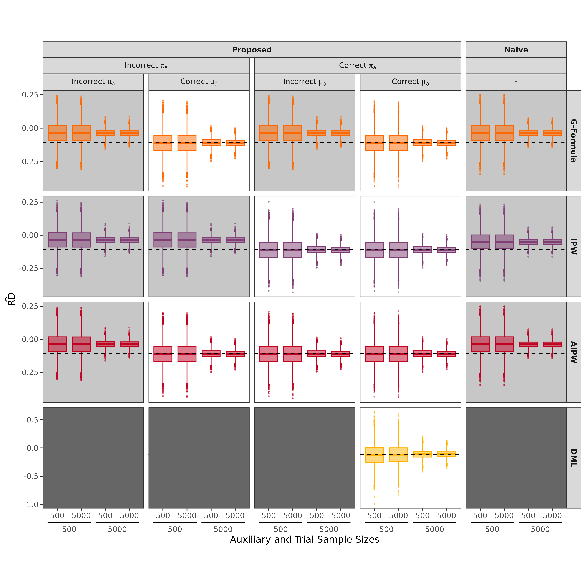
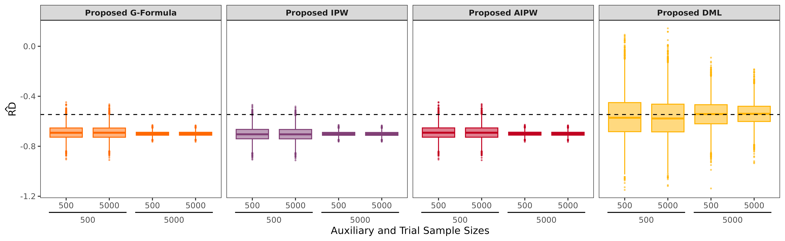

# crown

`crown` combines a cluster-randomized trial with an auxiliary sample to
estimate population mean potential outcomes, risk differences, and risk
ratios when trial outcomes are affected by nonresponse or censoring.

## Installation

Install from the package source directory:

```r
install.packages("remotes")
remotes::install_local(".")
```

## Quick start

```r
library(crown)
data(crown_example)

trial <- crown_example[crown_example$S == 1, ]
auxiliary <- crown_example[crown_example$S == 0, ]

fit <- crown(
  trial_data = trial,
  auxiliary_data = auxiliary,
  outcome = "Y",
  treatment = "A",
  response = "R",
  censoring = "C",
  cluster = "cluster",
  covariates = c("X1", "X2", "W1", "W2"),
  auxiliary_weight = "sampling_weight"
)

summary(fit)
```

The default is Proposed DML: the Proposed AIPW estimator with cross-fitted
XGBoost nuisance models.

## Supported analyses

| Analysis | `version` | `estimator` | `model` |
|---|---|---|---|
| Naive G-formula | `"naive"` | `"gformula"` | `"logistic"` |
| Proposed G-formula | `"proposed"` | `"gformula"` | `"logistic"` |
| Naive IPW | `"naive"` | `"ipw"` | `"logistic"` |
| Proposed IPW | `"proposed"` | `"ipw"` | `"logistic"` |
| Naive AIPW | `"naive"` | `"aipw"` | `"logistic"` |
| Proposed AIPW | `"proposed"` | `"aipw"` | `"logistic"` |
| Proposed DML | `"proposed"` | `"aipw"` | `"xgboost"` |

These are the only supported combinations. Use `K` to set the number of DML
cross-fitting folds and `arguments` to pass XGBoost settings.

## Data requirements

| Variable | Trial | Auxiliary |
|---|---|---|
| Cluster ID | Required | Required; must match a trial cluster |
| Treatment | Required and constant within cluster | Inherited from the trial cluster |
| Response indicator | Required | Not required |
| Censoring indicator | Required | Not required |
| Outcome | Required for uncensored responders | Not required |
| Covariates | Required | Same covariates required |
| Sampling weight | Not used | Optional |

Pass the trial and auxiliary samples as separate data frames. If auxiliary
sampling weights are unequal, provide the weight-column name through
`auxiliary_weight`; otherwise leave it as `NULL`.

## Simulations

Simulation 1 evaluates Naive and Proposed parametric estimators under correct
and incorrect nuisance-model specifications, together with Proposed DML.
Simulation 2 evaluates all seven estimators under a nonlinear data-generating
process; its main figures show the four Proposed estimators.

For a local run, set `mc_reps` near the top of the script and click Source in
RStudio or VS Code:

```r
source("simulation/sim_scripts/ss1.R")
source("simulation/sim_scripts/ss2.R")
```

Local results are saved as `sd_local.csv`; the fitted results are returned in
the `simulation` object, and the three figures are written to the corresponding
`sim_figures/sim1/local/` or `sim_figures/sim2/local/` directory.

The repository retains 10,000 Monte Carlo replicates for each simulation in
`simulation/sim_data/`. Run the analysis scripts to reproduce the figures:

```sh
Rscript simulation/sim_analysis/sim1_analysis.R
Rscript simulation/sim_analysis/sim2_analysis.R
```

### Simulation 1

<p align="center">
  
</p>

### Simulation 2

<p align="center">
  
</p>

Variance and confidence-interval coverage figures are stored in the same
`sim1` and `sim2` figure directories.

## Reference

To be added after publication.
